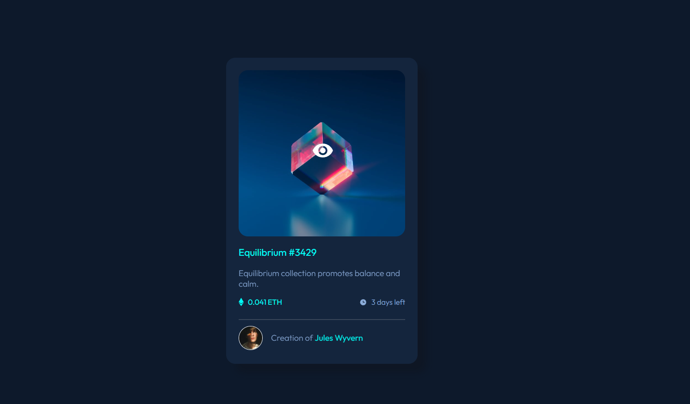

# Frontend Mentor - NFT preview card component solution

This is a solution to the [NFT preview card component challenge on Frontend Mentor](https://www.frontendmentor.io/solutions/nft-preview-card-component-W80ceIHK12). Frontend Mentor challenges help you improve your coding skills by building realistic projects. 

## Table of contents

- [Overview](#overview)
  - [Screenshot](#screenshot)
  - [Links](#links)
- [My process](#my-process)
  - [Built with](#built-with)
  - [What I learned](#what-i-learned)
  - [Continued development](#continued-development)
  - [Useful resources](#useful-resources)
- [Author](#author)
- [Acknowledgments](#acknowledgments)

## Overview

### Screenshot

### Links

- Solution URL: [Add solution URL here](https://www.frontendmentor.io/solutions/nft-preview-card-component-W80ceIHK12)
- Live Site URL: [Add live site URL here](https://nbuylding.github.io/NFT-preview-card/)

## My process

### Built with

- Semantic HTML5 markup
- CSS custom properties
- Flexbox

### What I learned

I learned how to create a hover overlay effect, how to center one image over another, and how to find solutions to issues that arose throughout this building process.

### Continued development

Concepts I'm not completely comfortable with and need to focus on are media queries and making websites more responsive to other device screen sizes.

### Useful resources

- [MDN](https://developer.mozilla.org/en-US/) - This helped to remind me how to use certain CSS tools.
- [Stack Overflow](https://stackoverflow.com/) - This helped me find the answers I needed through other people's experiences.

## Author

- Website - [Natasha B.](https://www.natashabuylding.com)
- Frontend Mentor - [@nbuylding](https://www.frontendmentor.io/profile/nbuylding)
- GitHub - [My GitHub](https://github.com/nbuylding)

